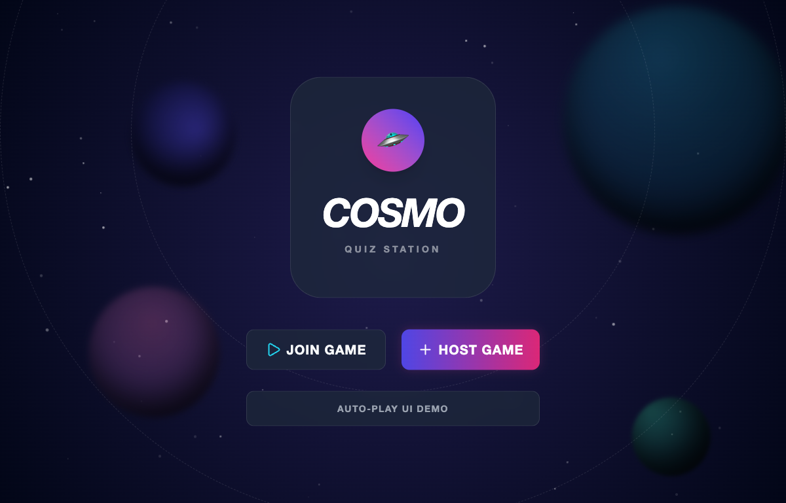
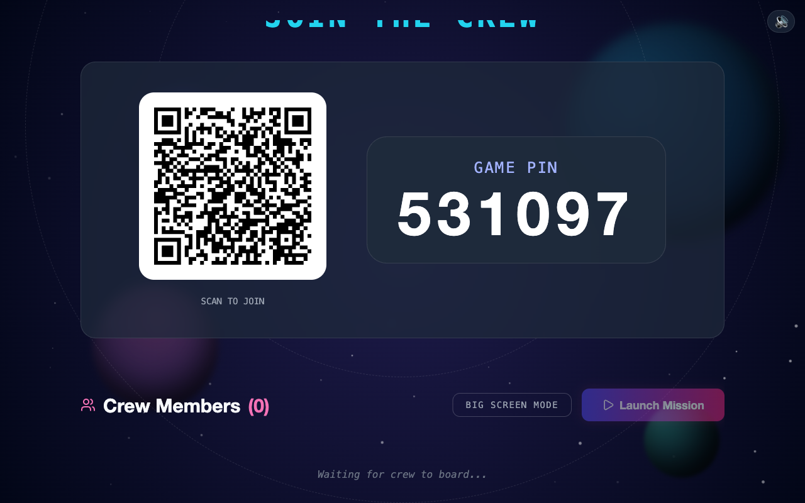
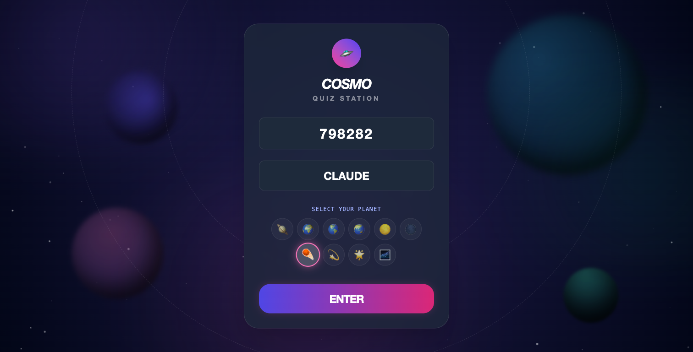
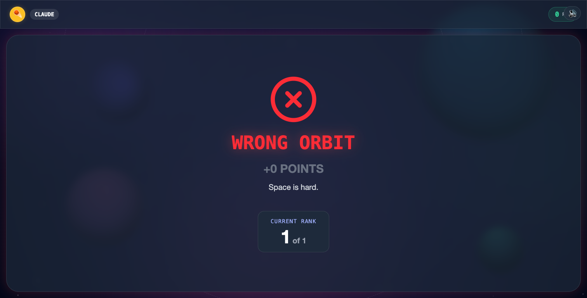

# Building StellarTrivia with Superpowers — A Case Study

> A teaching walkthrough of how the **superpowers** skill workflow shaped real
> decisions while building a live multiplayer quiz game. Every claim here is
> backed by a real commit, spec, or plan in this repo — open `git log` and
> follow along.

**The app:** StellarTrivia, a Kahoot-style real-time trivia game (Socket.io +
React 19, in-memory server state, Supabase for quiz storage). ~3 months, 19
pull requests, one developer + Claude Code.

**The point:** Almost none of the interesting work was "write feature X." It was
*deciding well* — what to spec, what to test first, what to measure, and what to
**not** build. Superpowers is the scaffolding that makes those good decisions the
default path instead of the disciplined exception.

### What shipped

| | |
|---|---|
|  |  |
| **Entry** — join or host | **Host view** — PIN + QR, crew boards |
|  |  |
| **Player join** — PIN, name, planet, no login | **Player lobby** — you're in |

> 📸 The host/player shots are from a live session on the deployed app. An
> attractive, browser-ready version of this case study lives alongside it:
> [`superpowers-case-study.html`](./superpowers-case-study.html).

---

## The core idea: match the cycle to the work

Superpowers is **not** "run every skill every time." It is: *every piece of work
goes through a disciplined path, and the path depends on the kind of work.*
Three kinds showed up building this game, each entering through a different
skill:

| Work type | The path it takes | Enters through | Examples in this repo |
|---|---|---|---|
| **New feature** | brainstorm → plan → build → review → verify → finish | `brainstorming` | PIN-join, image upload, leaderboards |
| **Bug** | reproduce → find the layer → fix → verify → finish | `systematic-debugging` | mobile Safari crash |
| **Refactor / hardening** | make it testable → change → verify → finish | `test-driven-development` | reconnection grace window |

**An honest caveat.** Not every feature here got the full treatment. 9 of 12
features have a design spec; the original scaffold, public hosting, and the
host-screen fit went straight to a plan; the hardening work has no spec at all.
That is the lesson, not a failure: the discipline scales to the **risk**, and a
bug is not brainstormed — it is debugged.

The rest of this doc follows **one feature (PIN-join) through the complete
feature cycle**, then shows how bugs and refactors enter the same machine
through different doors. Each skill is presented the same way:
**what it does → what it produced here → the decision it drove.**

---

## A complete feature cycle: "PIN Join — No Auth" (`2026-05-14`)

The problem: players were blocked at `/join` by a Google sign-in redirect, the
server only ran one game at a time, and there was no easy mobile join. Watch the
whole cycle solve it.

### 1 · 🧠 brainstorming — *what are we building, and what are we NOT?*

**What it does.** Before any code, it forces three questions — purpose,
constraints, success criteria — then 2–3 approaches, then an approved design doc.
The output is a `…-design.md` spec; its **Goals** and **Non-Goals** sections are
those questions, answered.

**In this build.** The spec pinned success and, crucially, scope:

- **Goals (success criteria):** join with a 6-digit PIN + nickname, no account;
  scan a QR to join; multiple concurrent games; host login unchanged.
- **Non-Goals (the "should we also…?" questions, answered *no*):** Redis,
  REST session endpoints, player accounts, horizontal scaling.
- **Approach question — "how do we stop Supabase firing on `/join`?"** The naive
  answer is "guard the redirect." Brainstorming traced the cause (a global
  `init()` in `App.tsx`) and chose to extract an `<AuthGate>` so `/join` never
  imports auth at all.

**The decision it drove.** A login-free join path *by design*, and four whole
sub-projects (Redis, REST, accounts, scaling) deliberately skipped on paper —
YAGNI at design time, for free.

> 💡 The same skill's **self-review** step caught a real defect in another
> feature: `01d1881` rewrote a vague image-delete step ("server resolves the
> path") into a precise contract before any code existed. Cheapest bug to fix is
> the one you fix in the spec.

### 2 · 📋 writing-plans — *exactly which files, in what order, verified how?*

**What it does.** Turns the approved spec into a task list a machine can run: a
**File Map** (every file, create vs. modify, why) and numbered tasks that each
end in *type-check → commit*. It even names its own executor.

**In this build.** The PIN-join plan opens with *"REQUIRED SUB-SKILL: Use
superpowers:subagent-driven-development… to implement this plan task-by-task,"*
lists exactly 4 files, and spells out Task 1 as: create `AuthGate.tsx` →
`npm run lint` → commit. That commit message is `adbc3b6` **verbatim** in the log.

**The decision it drove.** Building became assembly, not discovery — no "oh, I
also need to touch `store.ts`" surprises mid-stream.

### 3 · ⚙️ subagent-driven-development — *one task, one commit, verify, next*

**What it does.** Execute the plan task-by-task. Each task is small enough that a
fresh agent can run it cold (the plan is self-contained), and each ends in its
own commit, so history stays bisectable.

**In this build.** The clean run:

| Commit | Task |
|---|---|
| `adbc3b6` | add `AuthGate` component |
| `d469929` | move `init()` into `AuthGate` so `/join` never touches Supabase |
| `fe1cc96` | multi-session server: 6-digit PIN + room-scoped broadcasts |
| `866cc45` | *(corrective)* fix player disconnect, room cleanup, grace timer |

**The decision it drove.** Every step independently reviewable and revertable —
including `866cc45`, the catch that the multi-session refactor had broken
disconnect handling.

### 4 · 🌿 finishing-a-development-branch — *integrate it small and revertable*

**What it does.** When the work is complete and verified, pick how to land it
(merge / PR / cleanup) and keep the branch to one concern.

**In this build.** PIN-join shipped as **PR #3** — one feature, one branch, one
revert button. Across the project that's 19 small PRs, each undoable on its own.

**The decision it drove.** "Undo all of this" stays a one-line command instead of
git archaeology.

---

## Same machine, different doors: bugs and refactors

PIN-join was a *feature*, so it entered through brainstorming. Other work enters
elsewhere — and skipping brainstorming there is correct, not lazy.

### 🐛 systematic-debugging — *find the layer before you touch the fix* (a bug)

**What it does.** On any failure: reproduce it, identify *which layer* is failing,
form a hypothesis, and confirm the root cause before changing code — instead of
pattern-matching a plausible patch.

**In this build.** A player's iOS Safari tab died mid-game with *"A problem
repeatedly occurred."* The tempting move was "run more load tests." Debugging said:
that's not a JS error, it's a **render-process OOM** — wrong layer entirely. Root
cause: ~70 continuously animating, GPU-composited layers (`blur()` +
`mix-blend-screen`). Fix `8e9ff44` gated heavy effects behind a mobile check.

**The decision it drove.** Effort went to the real cause (client GPU), not to the
server load tests that are structurally blind to a browser crash.

### 🧪 test-driven-development — *make it testable, then change it* (a refactor)

**What it does.** For logic prone to silent corruption, get a failing test first,
then code to green. If the code isn't reachable by a test, make it reachable
before changing behavior.

**In this build.** Reconnection is exactly that kind of logic. The order was
forced:

1. `2221e6e` — extract game logic into `server/game.ts` **+ baseline socket test**
2. `5c61720` — *then* add the 30s host-disconnect grace window

The grace timer was built against an injectable `hostGraceMs` so a test could use
150ms instead of 30s. *Untestable timing is untested timing.*

**The decision it drove.** The logic was made importable and covered **before**
behavior changed — so the risky reconnection work was verifiable the moment it
landed.

### ✅ verification-before-completion — *evidence before "done"* (every path)

**What it does.** Before claiming something works, run the actual check and show
the output — and state plainly what is *not* verified.

**In this build.** Audio shipped with a literal proof-of-life commit: `76a61e2` —
*"smoke test passed — all assets 200, no JS errors, mute hidden without gamePin."*
And the honest inverse: the client reconnection path was flagged "built and
type-checks, but not auto-tested — needs a real-device check," not quietly marked
done.

**The decision it drove.** Claims matched evidence, and the one real gap was named
instead of hidden.

### 👀 requesting / receiving-code-review — *any holes before this merges?* (every merge)

**What it does.** Before landing, a review pass focused on correctness and
security; act on real issues, push back on wrong ones.

**In this build.** Public quiz hosting added an unauthenticated read endpoint
(`a4e4bde`); the very next commit, `c5255d1`, was *"prevent host_id leakage in
public endpoint."* Review caught a data-leak **before** it merged. The same pass
hardened the image upload endpoint (`d7453d3`: verify question ownership).

**The decision it drove.** Review changed the diff — it wasn't ceremony.

---

## Decisions superpowers steered us *away* from

The most valuable outputs were sometimes the code **not** written:

> **🛑 The answer-storm optimization we deliberately skipped.**
> Full-state broadcast on every answer is textbook O(N²). We *measured* it
> (50 players → 90ms event-loop stall; 100 → 480ms) instead of guessing, then
> chose **not** to fix it: the real target is ~40 players (~50ms, imperceptible).
> Measure-before-optimize + YAGNI skipped a whole project.

> **🛑 Auth that never loads on the join path.**
> The no-auth spec scoped Supabase behind `<AuthGate>` so `/join` never imports
> auth (`adbc3b6`, `d469929`) — a design decision, not a mid-build patch. A player
> needs only a PIN, a name, and a planet — no email, no password.

> **🛑 Database-backed live-state recovery we chose not to build.**
> In-memory state is fast and fragile. Rather than build crash-proof persistence,
> we *documented the boundary*: "survives client crashes, not server restarts."
> A named, honest gap beats a silent one.

---

## TL;DR — what to teach from this

1. **Match the cycle to the work.** Features go brainstorm → plan → build →
   review → verify → finish. Bugs enter through debugging; refactors through TDD.
   Skipping brainstorming on a bug is correct, not lazy.
2. **brainstorming pins scope, not just features.** Its Non-Goals are YAGNI
   happening on paper — and its self-review fixes bugs for the price of a sentence.
3. **Plans are executable.** A File Map + checkbox tasks turns building into
   assembly and lets a fresh subagent run each step cold.
4. **One task, one commit.** Bisectable, revertable history — the corrective
   commit is right there next to the feature commit.
5. **Make it testable before you change it.** Extract + baseline test first;
   injectable timing makes the untestable testable.
6. **Find the layer before the fix.** A client OOM is not solved with more server
   load tests.
7. **Evidence before "done"** — and name what you didn't verify.
8. **The best decision is sometimes to not build it.** Measure your real scale;
   YAGNI against it; document what you skip.

*See also the engineering deep-dive: [`lessons-realtime-multiplayer-games.md`](./lessons-realtime-multiplayer-games.md).*
